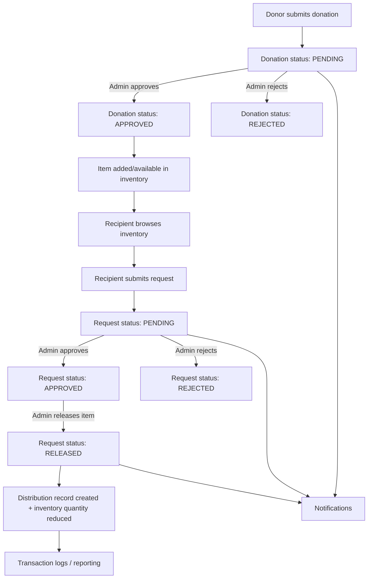

# CampusCares V2 — Concept, Functionalities, and Role Flows

This document explains the **core concept**, **system functionalities**, and **role-based user flows** of the CampusCares V2 project, based on the current frontend routes and backend REST APIs.

---

## Project concept (what CampusCares is)

**CampusCares** is a campus donation + inventory platform that connects:

- **Donors** (students/faculty/alumni) who submit items to donate
- **Recipients** (students in need) who browse/request items
- **Admins** (campus staff) who verify donations, manage inventory, approve requests, and release/distribute items

The platform’s goals are:

- **Sustainability**: reuse items instead of discarding them
- **Fair distribution**: ensure equitable access to donated essentials
- **Operational visibility**: dashboards, logs, and notifications to track impact

---

## System overview (high-level architecture)

- **Frontend**: React + Vite (dev server on `:5173`)
- **Backend**: Spring Boot REST API (server on `:8080`)
- **Database**: Supabase PostgreSQL (remote)

In local development, the frontend calls `/api/...` and Vite proxies requests to the backend on `http://localhost:8080`.

---

## User roles

The system currently implements **three roles**:

- **ADMIN**
  - Manages platform operations end-to-end
  - Approves/rejects donations and requests
  - Manages inventory visibility and distribution releases
  - Views transaction logs and notifications

- **DONOR**
  - Submits donation entries
  - Views donation history
  - Receives notifications (if applicable)

- **RECIPIENT**
  - Browses available inventory items
  - Submits item requests (with reason)
  - Views request history
  - Views basic recommendations
  - Receives notifications (updates + pickup/release info)

---

## Core lifecycle (end-to-end flow)

This is the project’s primary operational loop.

---

## Status model (what states exist)

Based on backend enums:

- **DonationStatus**: `PENDING` → `APPROVED` OR `REJECTED`
- **RequestStatus**: `PENDING` → `APPROVED` OR `REJECTED` → (optional) `RELEASED`

---

## Functionalities (feature list)

### Authentication and access control

- **Register**: create an account with a chosen role (`ADMIN`, `DONOR`, `RECIPIENT`)
- **Login**: sign in and store user session in local storage on the frontend
- **Route protection**: each dashboard route is restricted by role on the frontend

Key API:

- `POST /api/auth/register`
- `POST /api/auth/login`

### Donations (Donor + Admin)

- **Donor submits a donation**
  - Capture donor details, item name/category/condition, quantity, description
  - Optional metadata: `size`, `subjectOrCourse`
  - Result: donation created as `PENDING`

- **Admin reviews donations**
  - View all donations
  - View pending donations
  - Approve or reject donations

Key APIs:

- `POST /api/donations/submit?role=DONOR`
- `GET /api/donations/by-donor?donorEmail=...`
- `GET /api/donations/all`
- `GET /api/donations/pending?role=ADMIN`
- `PUT /api/donations/approve/{id}?role=ADMIN`
- `PUT /api/donations/reject/{id}?role=ADMIN`

### Inventory (Admin + Recipient)

- **Inventory catalog**
  - View all items
  - Search by keyword
  - Filter by category
  - View inventory statistics
  - Track metadata like `qrCode`, optional `size`, optional `subjectOrCourse`

Key APIs:

- `GET /api/inventory/all`
- `GET /api/inventory/search?keyword=...`
- `GET /api/inventory/category/{category}`
- `GET /api/inventory/low-stock`
- `GET /api/inventory/stats`

### Requests (Recipient + Admin)

- **Recipient submits a request**
  - Provide student name/email, requested item name, category, reason
  - Result: request created as `PENDING`

- **Admin reviews and decides**
  - View all requests
  - View pending requests
  - Approve or reject requests

Key APIs:

- `POST /api/requests/submit?role=RECIPIENT`
- `GET /api/requests/by-student?studentEmail=...`
- `GET /api/requests/student/{email}`
- `GET /api/requests/pending`
- `GET /api/requests/all`
- `PUT /api/requests/approve/{id}?role=ADMIN`
- `PUT /api/requests/reject/{id}?role=ADMIN`

### Distributions / Releases (Admin)

- **Admin releases items (distribution)**
  - Release record includes recipient identity, item name, quantity released, optional remarks
  - Typically follows an approved request
  - Produces a distribution record and impacts inventory counts

Key APIs:

- `GET /api/distributions/all`
- `GET /api/distributions/stats`
- `GET /api/distributions/search?keyword=...`
- `POST /api/distributions/release?role=ADMIN`

### Notifications (All roles)

- **User notifications**
  - Fetch notifications by email
  - Fetch unread notifications
  - Stats (read/unread totals + latest alert)
  - Mark one notification as read
  - Mark all as read
  - Create a notification (system/admin driven)

Key APIs:

- `GET /api/notifications/user?email=...`
- `GET /api/notifications/unread?email=...`
- `GET /api/notifications/stats?email=...`
- `PUT /api/notifications/read/{id}`
- `PUT /api/notifications/read-all?email=...`
- `POST /api/notifications/create`

### Dashboards, reporting, and audit logs (Admin)

- **Dashboard stats**
  - Total donations, total distributed items, pending requests, beneficiaries

- **Transaction logs**
  - Records actions, details, performer, timestamp

Key APIs:

- `GET /api/dashboard/stats?role=ADMIN`
- `GET /api/logs`

### Recommendations (Recipient)

- Basic recommendation endpoint that returns suggested inventory items for a student (based on email).

Key API:

- `GET /api/recommendations/student?email=...`

### Health checks (DevOps / debugging)

- Backend heartbeat:
  - `GET /api/health`
- Database connectivity check:
  - `GET /api/health/database`

---

## Frontend role flows (routes the UI provides)

### Public (unauthenticated)

- **Landing**: `/`
- **Login**: `/login`
- **Register**: `/register`

### Admin flow

- **Entry**
  - Login using role `ADMIN`
  - Redirect to admin routes

- **Main screens**
  - `/admin/dashboard` — high-level stats
  - `/admin/donations` — view donations
  - `/admin/donations/pending` — approve/reject pending donations
  - `/admin/inventory` — browse/search inventory + stats
  - `/admin/requests` — approve/reject recipient requests
  - `/admin/distributions` — release items + view distribution history/stats
  - `/admin/logs` — transaction log audit
  - `/admin/notifications` — admin notifications

### Donor flow

- **Entry**
  - Register as `DONOR` or login with role `DONOR`

- **Main screens**
  - `/donor/dashboard`
  - `/donor/donate` — submit donation
  - `/donor/history` — donation history
  - `/donor/notifications` — notifications

### Recipient flow

- **Entry**
  - Register as `RECIPIENT` or login with role `RECIPIENT`

- **Main screens**
  - `/recipient/dashboard`
  - `/recipient/inventory` — browse items
  - `/recipient/request` — submit request
  - `/recipient/history` — request history
  - `/recipient/recommendations` — suggestions
  - `/recipient/notifications` — notifications

---

## Role responsibilities (who does what)

### Admin responsibilities

- **Donation pipeline**
  - Approve/reject donations
  - Ensure only appropriate items are added to inventory

- **Request + fairness**
  - Approve/reject requests
  - Decide allocation of limited/high-demand items

- **Distribution execution**
  - Release items and log distributions
  - Maintain accurate inventory counts

- **Governance**
  - Monitor logs and notifications
  - Use dashboard stats to track program impact

### Donor responsibilities

- Submit accurate item details (category, condition, quantity, etc.)
- Track donation status and history

### Recipient responsibilities

- Browse inventory
- Submit requests with a clear reason
- Follow notifications for request updates and pickup/release details

---

## Notes and current implementation constraints

- **Frontend auth**: the logged-in user is stored in local storage (`campuscares_user`), and role-gated routes are enforced client-side.
- **Backend authorization**: many endpoints expect a `role` query parameter (e.g., `?role=ADMIN`) which is checked on the server for some actions.
- **Email-based retrieval**: donor/request history and notifications use email as a primary lookup key in multiple endpoints.

