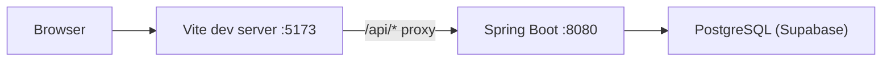

# CampusCares V2 — How to Run

Command steps and flow for local development.

---

## Architecture (dev flow)



| Layer    | Port | Role |
|----------|------|------|
| Frontend | 5173 | React + Vite (`npm run dev`) |
| Backend  | 8080 | Spring Boot REST API |
| Database | 5432 | Supabase PostgreSQL (remote) |

In dev, leave `VITE_API_BASE_URL` empty so the frontend calls `/api/...` and Vite proxies to `http://localhost:8080`.

---

## Prerequisites

- **Java 17** (JDK for backend)
- **Node.js 18+** and npm (frontend)
- **PostgreSQL** credentials (Supabase project)
- *(Optional)* **ngrok** — for sharing the dev app over HTTPS

---

## 1. One-time setup

```powershell
cd c:\Users\ASUS\Documents\tuga\CAMPUSCARE\CampusCares_V2
```

Copy environment file and fill in your Supabase values:

```powershell
copy .env.example .env
```

Edit `.env`:

- `DB_HOST`, `DB_PORT`, `DB_NAME`, `DB_USER`, `DB_PASSWORD`, `DB_SSLMODE`
- `VITE_API_BASE_URL=` — leave **empty** for local dev
- `NGROK_AUTHTOKEN=` — only if you use ngrok (optional)

Install frontend dependencies:

```powershell
npm install
```

### Database schema (Supabase)

- **Fresh project:** run [`supabase_setup.sql`](supabase_setup.sql) in the Supabase SQL Editor.
- **Existing Hibernate database:** run [`migrations/001_schema_alignment.sql`](migrations/001_schema_alignment.sql) once to rename legacy columns (`quantity_available` → `quantity`, `distributed_at` → `released_at`, `recipient_email` → `user_email`, etc.) and add missing columns (`request_id`, `source_donation_id`).
- After alignment, prefer `spring.jpa.hibernate.ddl-auto=validate` in production.
- On startup, `SchemaPatchRunner` adds missing notification/distribution/inventory columns when needed.
- Run end-to-end API verification: `powershell -ExecutionPolicy Bypass -File scripts/e2e-test.ps1` (backend must be on port 8080).

---

## 2. Run locally (recommended)

Use **three terminals** (backend → frontend → optional ngrok).

### Terminal 1 — Backend (Spring Boot)

```powershell
cd c:\Users\ASUS\Documents\tuga\CAMPUSCARE\CampusCares_V2
.\mvnw.cmd spring-boot:run
```

Or use the helper script (skips start if port 8080 is already in use):

```powershell
.\scripts\start-backend.cmd
```

Wait until the app is listening on **8080**.

**Verify:**

```powershell
curl http://localhost:8080/api/health
```

### Terminal 2 — Frontend (Vite)

```powershell
cd c:\Users\ASUS\Documents\tuga\CAMPUSCARE\CampusCares_V2
npm run dev
```

Or:

```powershell
.\scripts\start-frontend.cmd
```

Open in browser: **http://localhost:5173**

### Terminal 3 — ngrok (optional)

Only after the frontend is running on 5173. Set `NGROK_AUTHTOKEN` in `.env`, then:

```powershell
.\scripts\start-ngrok.cmd
```

Or PowerShell:

```powershell
.\scripts\start-ngrok.ps1
```

Use the HTTPS forwarding URL ngrok prints (tunnels to Vite; API still goes through the Vite proxy).

**ngrok free tier:** Browser API calls must include the `ngrok-skip-browser-warning` header or ngrok returns **403 Forbidden**. The frontend adds this automatically when you open the app via an `*.ngrok*` URL (`getApiHeaders()` in `src/api/config.ts`). Keep `VITE_API_BASE_URL` empty so `/api` requests stay on the Vite proxy.

---

## 3. Quick command cheat sheet

| Task | Command |
|------|---------|
| Install deps | `npm install` |
| Start API | `.\mvnw.cmd spring-boot:run` |
| Start UI | `npm run dev` |
| Build UI | `npm run build` |
| Preview UI build | `npm run preview` |
| Lint frontend | `npm run lint` |
| Package JAR | `.\mvnw.cmd clean package -DskipTests` |
| Health check | `curl http://localhost:8080/api/health` |

---

## 4. Run with Docker (backend only)

Build and run the Spring Boot container (expects `.env` / DB vars at runtime):

```powershell
cd c:\Users\ASUS\Documents\tuga\CAMPUSCARE\CampusCares_V2
docker build -t campuscares-v2 .
docker run -p 8080:8080 --env-file .env campuscares-v2
```

For full local UI + API, still run `npm run dev` on the host and keep `VITE_API_BASE_URL` empty (proxy to `localhost:8080`).

---

## 5. Stop services

| Service | How to stop |
|---------|-------------|
| Backend / Frontend | `Ctrl+C` in that terminal |
| Backend on 8080 (Windows) | `netstat -ano \| findstr :8080` then `taskkill /PID <pid> /F` |
| ngrok | `Ctrl+C` in ngrok terminal |

---

## 6. Troubleshooting

| Issue | What to check |
|-------|----------------|
| API errors in browser | Backend running on 8080; `VITE_API_BASE_URL` empty in dev |
| DB connection failed | `.env` Supabase host/password; `DB_SSLMODE=require` |
| Port 8080 in use | Stop old Java process or use `start-backend.cmd` message for PID |
| `npm` blocked (PowerShell policy) | Use `npm.cmd` or `.\scripts\start-frontend.cmd` |
| CORS in dev | Do not set `VITE_API_BASE_URL` to full URL locally — use Vite proxy |

---

## Startup order (summary)

1. Configure `.env` from `.env.example`
2. `npm install` (once)
3. `.\mvnw.cmd spring-boot:run` → **:8080**
4. `npm run dev` → **:5173**
5. Open **http://localhost:5173**
6. *(Optional)* `.\scripts\start-ngrok.cmd` for public HTTPS URL
